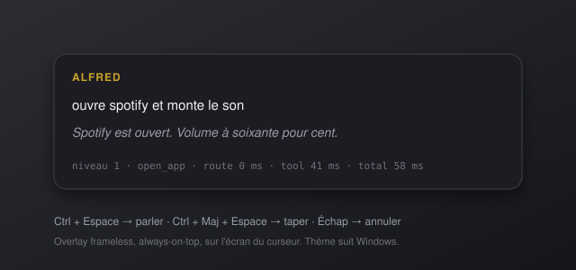

<p align="center">
  
</p>

<h1 align="center">ALFRED</h1>

<p align="center">
  <em>Majordome vocal local pour Windows 11. Il comprend le français, agit sur votre machine et répond d'une voix posée. Rien ne quitte votre PC.</em>
</p>

<p align="center">
  <a href="https://github.com/Captain-VII/alfred/actions/workflows/ci.yml"></a>
  <a href="https://github.com/Captain-VII/alfred/releases/latest"></a>
  <a href="LICENSE"></a>
  
  
</p>

---

<p align="center">
  
</p>

> **Ctrl + Espace** → « *Alfred, monte le son et ouvre Spotify* » → *« Volume à soixante pour cent. Spotify est ouvert. »*

## Pourquoi Alfred

- **Local, point.** LLM (Ollama), reconnaissance vocale (faster-whisper) et synthèse (Piper) tournent sur votre machine. Pas de compte, pas de clé API, pas de cloud.
- **Rapide.** Un routeur à trois niveaux fait que « monte le son » ne traverse jamais un LLM : moins de 400 ms entre la fin de la phrase et l'action pour les commandes courantes.
- **Un majordome, pas un chatbot.** Vouvoiement, une phrase, deux au plus. « C'est fait. » Jamais « Bien sûr ! Je serais ravi de vous aider ! ».

## Installation en 3 étapes

1. **Installez [Ollama](https://ollama.com/download/windows)** et lancez-le (une icône apparaît dans la barre système).
2. **Téléchargez `Alfred-Setup-x.y.z.exe`** depuis la [dernière release](https://github.com/Captain-VII/alfred/releases/latest) et exécutez-le.
3. **Suivez l'assistant de premier lancement** : il télécharge le modèle de langage (`llama3.1:latest`, ~4,9 Go) et la voix (~60 Mo), teste votre micro et vos haut-parleurs.

Alfred vit ensuite dans la barre système. **Ctrl + Espace** pour parler, **Ctrl + Maj + Espace** pour taper, **Échap** pour tout annuler.

<details>
<summary><strong>Installation depuis les sources</strong></summary>

```bash
git clone https://github.com/Captain-VII/alfred.git
cd alfred
python -m venv .venv
.venv\Scripts\activate
pip install -e ".[dev]"
python -m alfred
```

Pour tester une commande sans interface ni micro :

```bash
python -m alfred --cli "rappelle-moi dans 20 minutes de sortir le gâteau" --no-tts
```

</details>

## Commandes

Les formulations ci-dessous sont reconnues instantanément (niveau 1). Toute variante proche est rattrapée par la similarité sémantique (niveau 2), et le reste par le LLM (niveau 3), y compris les questions ouvertes.

| Domaine | Exemples | Notes |
|---|---|---|
| **Applications** | « ouvre Spotify », « lance le navigateur », « ferme-la », « bascule sur VS Code » | Résolution floue : « spotifaille », « mon éditeur de code ». Alias configurables. |
| **Volume** | « monte le son », « baisse le volume de 20 », « volume à 30 % », « plus fort », « coupe le son » | Absolu, relatif, mots-clés, nombres en lettres. |
| **Luminosité** | « baisse la luminosité », « luminosité à 40 % », « écran plus lumineux » | Écrans compatibles DDC/CI ou portables. |
| **Session** | « verrouille l'écran », « mets en veille », « éteins l'ordinateur », « redémarre le PC » | Arrêt et redémarrage demandent confirmation. |
| **Capture / DND** | « capture d'écran », « ne pas déranger », « remets les notifications » | Capture dans `Images\Alfred`. |
| **Média** | « pause », « suivant », « piste précédente », « arrête la musique » | Touches média : Spotify, YouTube, VLC… |
| **Web** | « cherche sur internet la météo à Lyon », « qu'est-ce que le protocole MCP » | DuckDuckGo, lecture de la page, résumé en 2-3 phrases, source citée. Annonce l'absence de réseau. |
| **Fichiers** | « cherche le fichier budget 2024 », « ouvre-le », « montre-le dans l'explorateur » | Everything si installé, sinon parcours des dossiers utilisateur. |
| **Fenêtres** | « réduis la fenêtre », « plein écran », « côte à côte », « Spotify à gauche et Firefox à droite », « montre le bureau » | |
| **Presse-papier** | « lis le presse-papier », « traduis-le en anglais », « résume ça », « corrige les fautes » | Le résultat remplace le presse-papier. |
| **Minuteurs** | « rappelle-moi dans 20 minutes de sortir le gâteau », « minuteur de 5 minutes », « annule le rappel » | Notification Windows + annonce vocale + son. |
| **Contexte** | « ouvre Spotify » … « ferme-la » | Les 5 derniers tours sont conservés. |

## Comment ça marche

```
Entrée (voix → faster-whisper, ou texte)
   │  clic sonore immédiat
   ├─► Niveau 1 — regex déclarées par les tools          ~0 ms    « monte le son »
   ├─► Niveau 2 — embeddings locaux des exemples          ~15 ms   « je veux plus de volume »
   └─► Niveau 3 — Ollama, tool calling                    ~0,6-1,5 s  formulation libre, questions
                       │
                  exécution async ──► réponse Piper streamée phrase par phrase
```

Mesuré avec `python scripts/benchmark.py` (Ryzen, RTX, modèles préchargés) :

| Étape | Médiane |
|---|---|
| Routage niveau 1 | < 0,1 ms |
| Routage niveau 1 + exécution du tool | 0,1 ms |
| Routage niveau 2 (embedding + recherche) | 1,3 ms |
| Piper, une phrase courte | 22 ms |
| Niveau 3, `llama3.1` préchargé, action simple | 0,5 s |
| Niveau 3 avec recherche web (lecture de page + résumé) | 2,1 s |

Coûts payés une seule fois au démarrage, jamais pendant une commande : index sémantique 1,0 s (puis 2 ms depuis le cache disque), voix Piper 1,1 s, modèle Whisper 1,1 s.

Ce qui rend ça possible : Ollama préchargé (`keep_alive: -1`) avec requête de warm-up, Whisper et Piper chargés une fois en RAM, embeddings calculés au boot et cachés sur disque, tools `async`, TTS qui démarre pendant l'exécution des tools lents.

## Ajouter un tool

Un tool est une coroutine décorée. Le décorateur génère le schéma JSON pour le LLM, enregistre les exemples pour le niveau 2 et les regex pour le niveau 1. Créez un fichier dans `alfred/tools/` (ou complétez un existant) : il est découvert automatiquement.

```python
# alfred/tools/lights.py
from alfred.tools.base import ToolError, tool

@tool(
    name="set_lights",
    description="Allume ou éteint les lumières du bureau.",
    examples=["allume la lumière", "éteins les lumières", "lumière du bureau"],
    patterns=[r"(?P<state>allume|éteins) (?:la |les )?lumières?(?: du bureau)?"],
    params={"state": "« allume » ou « éteins »"},
    confirm=False,          # True → confirmation vocale avant exécution
    category="domotique",
)
async def set_lights(state: str) -> str:
    on = state.startswith("allume")
    ok = await my_home_api.set("bureau", on)       # votre code, async
    if not ok:
        raise ToolError("le pont domotique ne répond pas.")   # lu à voix haute, jamais de crash
    return "Lumières allumées." if on else "Lumières éteintes."   # accusé de réception parlé
```

Règles :

- **`examples`** est obligatoire : c'est ce qui alimente le niveau 2. Cinq à dix formulations naturelles, variées.
- **`patterns`** : regex `fullmatch`, insensibles à la casse, appliquées au texte normalisé (minuscules, politesses retirées). Les **groupes nommés** deviennent des paramètres.
- Les **types** des paramètres sont déduits de la signature (`str`, `int`, `float`, `bool`, `list[str]`) et convertis automatiquement, que la valeur vienne d'une regex ou du LLM.
- Un paramètre **sans valeur par défaut** est obligatoire : le niveau 2 ne déclenchera le tool que si une regex l'a extrait, sinon il laisse le LLM le déduire.
- **`internal=[...]`** masque des paramètres du schéma envoyé au LLM. À utiliser pour tout paramètre qui n'existe que pour recevoir un groupe de regex : sans cela le modèle s'en saisit et invente des valeurs. C'est ce qui sépare `level` (« mets le volume à 25 ») des drapeaux `up` / `down` / `delta` de `set_volume`.
- **Aucun appel système direct** : passez par `alfred/tools/_win.py` (c'est ce que les tests remplacent), et exécutez le bloquant via `_win.run_blocking(...)`.
- Besoin du LLM, du TTS ou de la config ? `from alfred.core import services` → `services.llm.complete(...)`, `services.say(...)`, `services.cfg()`.

Ajoutez un test dans `tests/` avec la fixture `system` (système simulé) et une ligne dans le tableau ci-dessus.

## Configuration

Le fichier `%APPDATA%\Alfred\config.yaml` est créé au premier lancement à partir de [`config.default.yaml`](config.default.yaml) et **rechargé à chaud** à chaque sauvegarde. Le panneau de réglages (icône de la barre système → Réglages…) modifie le même fichier.

```yaml
hotkeys:
  invoke_voice: ctrl+space
  invoke_text: ctrl+shift+space
  cancel: escape
  push_to_talk: false          # true = enregistrer tant que la touche est maintenue

llm:
  model: llama3.1:latest   # tout modèle Ollama avec tool calling
  fallback_model: llama3.2:3b
  keep_alive: -1

stt:
  model: small                 # tiny | base | small | medium | large-v3
  device: auto                 # cuda si disponible

tts:
  voice: fr_FR-gilles-low      # ou fr_FR-tom-medium
  length_scale: 1.08           # > 1 = plus lent
  sentence_silence: 0.35

router:
  semantic_threshold: 0.82     # baisser = plus permissif, plus de faux positifs
  semantic_margin: 0.05        # écart requis avec le 2e candidat, sinon on laisse le LLM trancher
  enable_llm_fallback: true

persona:
  mode: formal                 # formal | concise
  address: monsieur

app_aliases:
  navigateur: firefox.exe
  musique: Spotify.exe
```

Toute clé peut aussi être surchargée par variable d'environnement : `ALFRED__LLM__MODEL=llama3.1:8b`.

### Voix

Deux voix masculines françaises sont proposées. `fr_FR-gilles-low` est la plus posée et la plus rapide ; `fr_FR-tom-medium` est plus riche mais légèrement plus lente. Changez `tts.voice` dans les réglages : la nouvelle voix est téléchargée automatiquement. Les modèles sont stockés dans `%APPDATA%\Alfred\voices`.

## Dépannage

| Symptôme | Cause probable | Remède |
|---|---|---|
| « Mon jugement me fait défaut… » | Ollama ne tourne pas ou le modèle est absent | Lancez Ollama, puis `ollama pull llama3.1`. |
| Alfred n'entend rien | Mauvais micro sélectionné | Réglages → Modèles → Microphone. Vérifiez aussi la confidentialité Windows (accès au micro pour les applications de bureau). |
| Le raccourci ne répond pas | Une autre application capture Ctrl+Espace (souvent un IME ou un IDE) | Changez `hotkeys.invoke_voice` (ex. `alt+space`, `f9`). |
| Première réponse LLM très lente | Modèle en cours de chargement | Normal au premier appel ; `keep_alive: -1` le garde ensuite en mémoire. |
| Réponses lentes en général | Whisper sur CPU, ou modèle 8B sans GPU | `stt.model: base` et `llm.model: llama3.2:3b`. |
| « Whisper bascule sur le processeur » dans les logs | cuBLAS ou cuDNN manquants à côté de CUDA | Rien à faire, Alfred continue sur le processeur. Pour retrouver le GPU, installez cuBLAS et cuDNN 9. |
| Alfred prononce du JSON | Modèle sans tool calling fiable | Utilisez `llama3.1` ou `qwen2.5:7b-instruct`. Les appels illisibles sont normalement filtrés. |
| « Cette application n'est pas installée » | Nom trop éloigné ou app hors menu Démarrer | Ajoutez un alias dans `app_aliases`. |
| La recherche web échoue | Hors ligne, ou DuckDuckGo limite | Alfred l'annonce ; réessayez plus tard. |
| Rien ne se passe, aucune icône | Une instance tourne déjà | Gestionnaire des tâches → Alfred.exe, ou tray → Redémarrer. |

Les logs sont dans `%APPDATA%\Alfred\logs\alfred.log` (tray → « Ouvrir les logs »), conservés 7 jours. Passez `behavior.log_level: debug` et `behavior.show_metrics: true` pour voir les latences de chaque étape dans l'overlay.

## Développement

```bash
pip install -e ".[dev]"
pytest                      # 175 tests, aucun appel système réel
ruff check . && mypy alfred
python scripts/benchmark.py # tableau de latence par étape
python scripts/build.py     # dist/Alfred/ + installer/Output/Alfred-Setup-x.y.z.exe
```

Structure :

```
alfred/
├── core/       router (3 niveaux), llm (Ollama), executor, context, services
├── audio/      stt (faster-whisper + VAD), tts (Piper streamé), sounds
├── tools/      base (@tool) + apps, system, media, web, files, window, clipboard, timer
├── ui/         overlay, tray, settings, wizard, theme
├── persona/    system prompt, variantes de réponses
├── app.py      assemblage (Qt + boucle asyncio + hotkeys)
└── updater.py  GitHub Releases, installation silencieuse
```

Voir [CONTRIBUTING.md](CONTRIBUTING.md) et [CHANGELOG.md](CHANGELOG.md).

## Licence

[MIT](LICENSE). Les voix Piper sont sous leurs licences respectives (voir [rhasspy/piper-voices](https://huggingface.co/rhasspy/piper-voices)).
